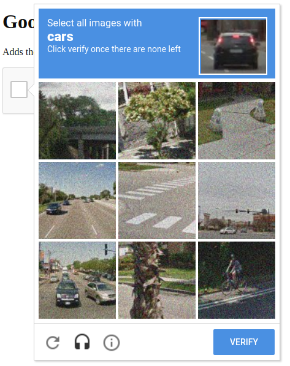
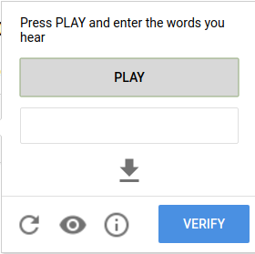

# outCaptcha
## Solving reCAPTCHA 2.0 Without Human Interaction (Python & Javascript)

<i>Ideally a future version will be implemented in pure Javascript and the flask app won't be needed</i>

## How to Run

```console
foo@bar:~$ chromium-browser --disable-web-security -user-data-dir=~/ & python app.py
```

<i>Note: Starting chrome without cross-origin resource sharing is necessary to interact with the reCAPTCHA iframe using JS.</i>

In Chrome, navigate to "chrome://extensions" and drag the ~/extensions/ directory into the browser window.

Configure the Chrome extension with a valid Google Cloud Speech-To-Text API key (Pictured)

<p align="center">
  
</p>

## Testing

Check out https://patrickhlauke.github.io/recaptcha/ to test the functionality.

## Technological Overview

The extension uses chrome.webRequest with the following URL pattern to detect the presence of a captcha on the web page:

```
https://www.google.com/recaptcha/api2/bframe?*
```

<p align="center">
  
</p>
<p align="center">After detecting a Captcha, the extension uses the following JS code to "Click" the checkbox indicating a human is present:</p>

```javascript
// This code snippet can be found in extension/background.js
chrome.tabs.executeScript({ code: `document.querySelector('[role="presentation"]').contentWindow.document.getElementById("recaptcha-anchor").click()` });
```

<p align="center">
  
</p>
<p align="center">After successfully clicking the checkbox, reCAPTCHA 2.0 triggers the user to complete an image verification.  Rather than completing the image verification, onCaptcha will click the Audio Accessibility button to request an Audio-based Captcha</p>

```javascript
chrome.tabs.executeScript({ code: `document.querySelector('[title="recaptcha challenge"]').contentWindow.document.getElementById("recaptcha-audio-button").click()` });
```

<p align="center">Since loading times differ for the audio file, onCaptcha monitors network activity using chrome.webRequest to detect URLs matching the following pattern:</p>

```
https://www.google.com/recaptcha/api2/payload?*
```

<p align="center">
  
</p>
<p align="center">After detecting that the Audio-based captcha was successfully loaded, onCaptcha grabs the URL of the audio file and sends a POST request to localhost containing the URL and the API Key used to configure the extension.
