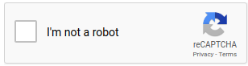

# outCaptcha
## Solving reCAPTCHA 2.0 Without Human Interaction (Python & Javascript)

<i>Ideally a future version will be implemented in pure Javascript and the flask app won't be needed</i>

## How to Run

```console
foo@bar:~$ chromium-browser --disable-web-security -user-data-dir=~/ & python app.py
```

<i>Note: Starting chrome without cross-origin resource sharing is necessary to interact with the reCAPTCHA iframe using JS.</i>

In Chrome, navigate to "chrome://extensions" and drag the ~/extensions/ directory into the browser window.

Configure the Chrome extension with a valid Google Cloud Speech-To-Text API key (Pictured)

<p align="center">
  
</p>

## Testing

Check out https://patrickhlauke.github.io/recaptcha/ to test the functionality.

## Technological Overview

<p align="center">
  
</p>
<p align="center">Starting with Unsolved Captcha, the Chrome Extension executes: </p>

```javascript
chrome.tabs.executeScript(
{ code: `document.querySelector('[role="presentation"]'
).contentWindow.document.getElementById("recaptcha-anchor").click()` });
```


