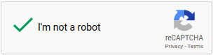
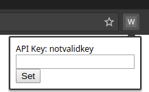
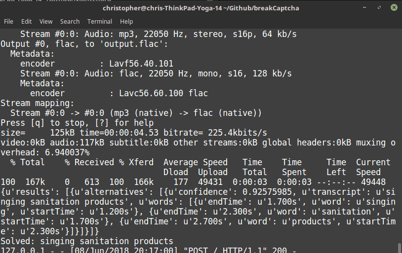
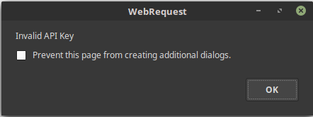

<h2 align="center">outCaptcha - Solving reCAPTCHA 2.0 Without Human Interaction</h2>
<p align="center"><i>
  
</i></p>


<h1 align="center"><a href="https://www.youtube.com/watch?v=lnmtqPam1qg">Watch the outCaptcha extension solve reCAPTCHA 2.0</a></h1>


## How to Run

```console
foo@bar:~$ chromium-browser --disable-web-security -user-data-dir=~/ & python app.py
```

<p align="center"><b>Note: Starting chrome with cross-origin resource sharing is necessary to interact with the reCAPTCHA iframe.</b></p>

In Chrome, navigate to "chrome://extensions" and drag the ~/extensions/ directory into the browser window.


<p align="center"><i>
  
</i></p>
<p align='center'>Configure the Chrome extension with a valid Google Cloud Speech-To-Text API key</p>

## Technological Overview

### Javascript

After detecting a Captcha, the extension uses the following JS code to "Click" the checkbox indicating a human is present:

```javascript
// This code snippet can be found in extension/background.js
chrome.tabs.executeScript({ code: `document.querySelector('[role="presentation"]').contentWindow.document.getElementById("recaptcha-anchor").click()` });
```

After successfully clicking the checkbox, reCAPTCHA 2.0 triggers the user to complete an image verification.  Rather than completing the image verification, outCaptcha will click the Audio Accessibility button to request an Audio-based Captcha with this JS code:

```javascript
// This code snippet can be found in extension/background.js
chrome.tabs.executeScript({ code: `document.querySelector('[title="recaptcha challenge"]').contentWindow.document.getElementById("recaptcha-audio-button").click()` });
```

After using chrome.webRequest to detect that the Audio-based captcha was successfully loaded, outCaptcha grabs the URL of the audio file and sends a POST request to localhost containing the URL and the API Key used to configure the extension.  After the backend processing is completed outCaptcha will input the solution and click the verify button using Javascript:

```javascript
// This code snippet can be found in extension/background.js
chrome.tabs.executeScript({code: `document.querySelector('[title="recaptcha challenge"]').contentWindow.document.getElementById('audio-response').value = "` + returnVal + '"'});
// Clicks the input box and types in the captcha solution
chrome.tabs.executeScript({code: `document.querySelector('[title="recaptcha challenge"]').contentWindow.document.getElementById("recaptcha-verify-button").click()` });
// Clicks the verify button
```

### Python

<p align="center"><i>
  
</i></p>
<p align="center"><i>The python-based server downloads the RAW audio file and converts it to FLAC format using FFMPEG.  This FLAC file is then encoded as Base64 and sent to Google's Speech-To-Text API.  The Captcha solution is returned as a string.</i></p>

### URL Matching

The extension uses chrome.webRequest with the following URL pattern to detect the presence of a captcha on the web page:

```
https://www.google.com/recaptcha/api2/bframe?*
```

Since loading times can differ for the Audio-based Captcha, outCaptcha monitors network activity using chrome.webRequest to detect URLs matching the following pattern:

```
https://www.google.com/recaptcha/api2/payload?*
```

## Error Handling

<p align="center"><i>
  
</i></p>
<p align="center"><i>outCaptcha will detect invalid API keys, and will trigger the user to input a valid API key if an error occurs during speech-to-text conversion</i></p>


